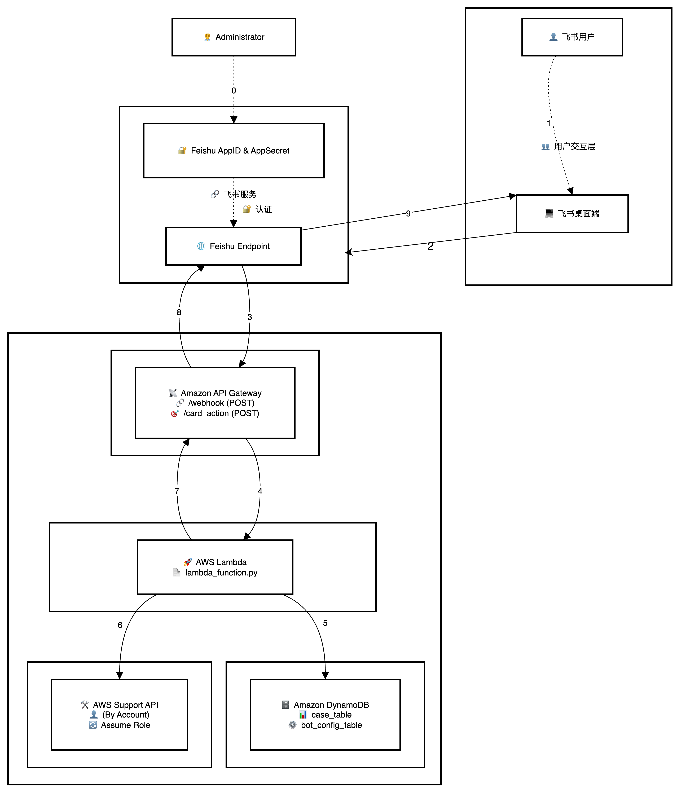

# 飞书AWS工单机器人

🤖 飞书 AWS 工单机器人是一套基于飞书企业通信工具构建的便捷沟通工具，旨在实现用户与 AWS 售后工程师之间的快捷文字交流。飞书用户能够借助简单的机器人关键字及飞书小卡片进行互动，从而向售后工程师团队提交支持案例、更新案例内容，并准实时接收后台工程师的相关更新。该机器人采用模块化架构，支持在 AWS Lambda 上进行无服务部署。

## 📁 项目结构

```
lark-aws-lambda/
├── lambda_function.py    # Lambda入口函数（路由分发）
├── utils.py             # 配置管理、日志、异常处理等工具类
├── ticket_handler.py    # 工单核心业务逻辑
├── feishu_service.py    # 飞书API服务封装（lark-oapi SDK）
├── aws_service.py       # AWS服务封装（DynamoDB、Support API）
├── requirements.txt     # Python依赖
├── deployment/          # 部署相关文件
│   ├── template.yaml    # CloudFormation模板
│   ├── deploy-serverless.sh  # 部署脚本
│   └── events/          # 测试事件
│       ├── card_action_event.json
│       └── webhook_event.json
├── config/             # 配置文件
│   └── .env.example    # 环境变量示例
├── docs/               # 文档目录
│   ├── README.md       # 详细文档
│   └── 使用说明.md     # 使用指南
├── images/             # 图片资源
│   └── 20250821-151454.png # 项目架构图
└── .gitignore          # Git忽略文件
```

## 🏗️ 项目架构



## 🚀 快速开始

1. **配置环境**：
   ```bash
   cp config/.env.example .env
   # 编辑.env文件，填入您的飞书和AWS配置
   ```

2. **一键部署**：
   ```bash
   cd deployment
   ./deploy-serverless.sh
   ```

3. **使用机器人**：
   - 发送 `开工单 [标题]` 创建工单
   - 发送 `历史` 查看历史工单
   - 发送 `帮助` 获取使用说明

## 📖 详细文档

- [📋 详细说明](docs/README.md) - 完整的项目文档
- [🔧 使用指南](docs/使用说明.md) - 详细的使用说明

## ✨ 主要特性

- 🏗️ **模块化架构**：清晰的分层设计，易于维护
- ☁️ **无服务部署**：基于AWS Lambda，按需付费
- 💬 **群聊协作**：自动创建飞书讨论群聊
- 📊 **数据持久化**：DynamoDB存储工单信息
- 🔒 **安全可靠**：完善的错误处理和日志记录

---

📝 **快速上手**：查看 [docs/README.md](docs/README.md) 获取完整文档