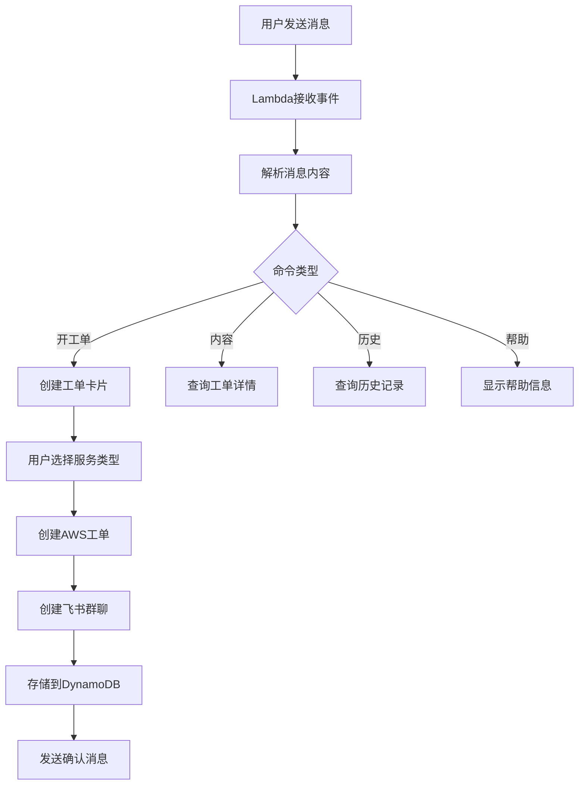

# 飞书AWS工单机器人

基于模块化架构的飞书AWS工单机器人，支持AWS Lambda无服务部署，帮助用户通过飞书快速创建和管理AWS工单。

## ✨ 功能特点

- 🤖 **智能交互**：支持关键字触发（开工单、内容、历史、帮助）
- 📋 **卡片界面**：简洁的服务类型和严重级别选择
- 💬 **群聊协作**：工单创建后自动创建飞书讨论群聊
- 📊 **数据存储**：通过DynamoDB存储工单信息
- 🏗️ **模块化架构**：清晰的代码结构，易于维护和扩展
- ☁️ **无服务部署**：基于AWS Lambda，按需付费，自动扩缩容

## 📁 项目结构

```
├── lambda_function.py      # Lambda入口函数
├── utils.py               # 配置管理和工具函数
├── ticket_handler.py      # 工单处理逻辑
├── feishu_service.py      # 飞书API服务
├── aws_service.py         # AWS服务封装
├── requirements.txt       # 依赖管理
├── deployment/            # 部署相关
│   ├── template.yaml          # SAM部署模板
│   ├── deploy-serverless.sh  # 部署脚本
│   └── events/               # 测试事件
├── config/                # 配置文件
│   └── .env.example          # 环境变量模板
├── docs/                  # 文档目录
│   ├── README.md             # 项目说明
│   ├── 使用说明.md            # 使用指南
│   ├── 无服务部署指南.md      # 部署指南
│   └── 群聊功能验证清单.md    # 验证清单
├── tests/                 # 测试目录
└── .env.example          # 环境变量模板
```

## 🚀 快速部署

### 环境配置

1. 复制环境变量模板：
```bash
cp .env.example .env
# 或者使用config目录下的模板
cp config/.env.example .env
```

2. 编辑配置文件，填入您的信息：
```bash
# AWS配置
AWS_REGION=us-east-1
AWS_ACCOUNT=123456789012
DYNAMODB_TABLE=aws-tickets

# 飞书应用配置
FEISHU_APP_ID=cli_a1b2c3d4e5f6g7h8
FEISHU_APP_SECRET=abcdefghijklmnopqrstuvwxyz123456
FEISHU_ENCRYPT_KEY=encrypt_key_example_12345
FEISHU_VERIFICATION_TOKEN=v_token_example_abcdef123456
```

### 一键部署

```bash
cd deployment
./deploy-serverless.sh
```

### 手动部署

```bash
# 构建应用
cd deployment
sam build

# 部署应用
sam deploy --guided  # 首次部署
sam deploy          # 后续部署
```

## 📖 使用方法

### 基本命令

在飞书中向机器人发送以下关键字：

| 命令 | 功能 | 示例 |
|------|------|------|
| `开工单` | 创建新工单 | 开工单 EC2实例无法启动 |
| `内容` | 查看工单详情 | 内容 |
| `历史` | 查看历史工单 | 历史 |
| `帮助` | 查看帮助信息 | 帮助 |

### 工单创建流程

1. 发送 `开工单 [标题]` 创建工单
2. 选择服务类型（EC2、RDS、S3等）
3. 选择严重级别（低、中、高、紧急）
4. 系统自动创建AWS工单和飞书群聊
5. 在群聊中协作讨论和跟进

## 🔧 配置说明

### 模块说明

#### 核心模块
- **lambda_function.py**: Lambda入口文件
  - 请求路由和分发
  - 统一错误处理
  - 响应格式化

- **utils.py**: 配置管理和工具函数
  - 环境变量加载和配置管理
  - 异常处理装饰器
  - 日志管理和重试机制
  - 数据验证工具

- **ticket_handler.py**: 工单业务逻辑
  - 工单创建和管理
  - 飞书事件处理
  - 卡片交互响应
  - 业务流程编排

- **feishu_service.py**: 飞书API服务
  - 访问令牌管理
  - 消息发送和接收
  - 群聊管理
  - 卡片交互处理

- **aws_service.py**: AWS服务封装
  - DynamoDB数据操作
  - AWS Support API调用
  - 错误处理和重试机制

### 飞书应用配置

1. 在飞书开发者平台创建应用
2. 配置机器人权限和事件订阅
3. 获取应用凭证信息

### AWS配置

1. 确保AWS账号有Support API权限
2. 配置DynamoDB表权限
3. 设置Lambda执行角色

## 📊 工作流程



## 📝 监控日志

查看Lambda函数日志：
```bash
sam logs -n LarkBotFunction --stack-name lark-aws-bot
```

实时监控：
```bash
sam logs -n LarkBotFunction --stack-name lark-aws-bot --tail
```

## 📚 更多文档

- [使用说明](使用说明.md) - 详细的使用指南

## 🤝 贡献

欢迎提交Issue和Pull Request来改进项目。

## 📄 许可证

MIT License